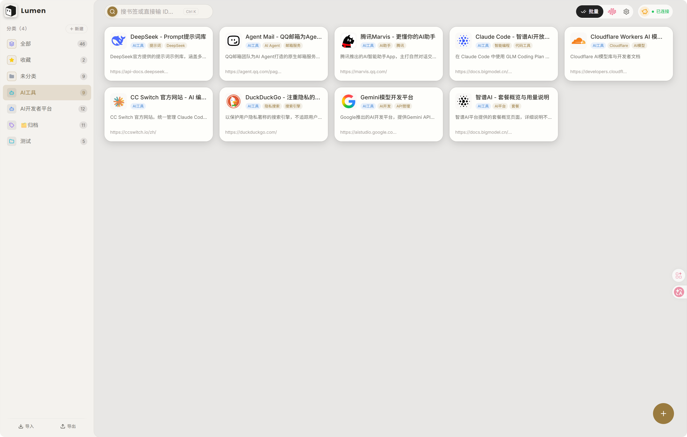
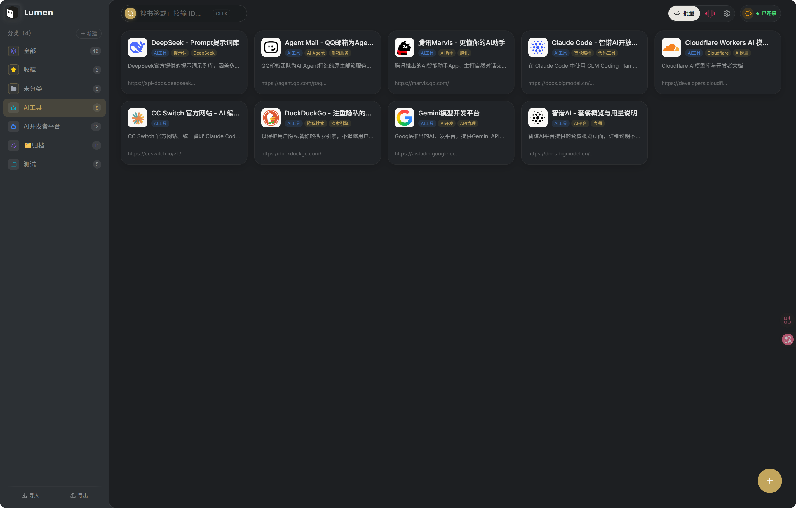
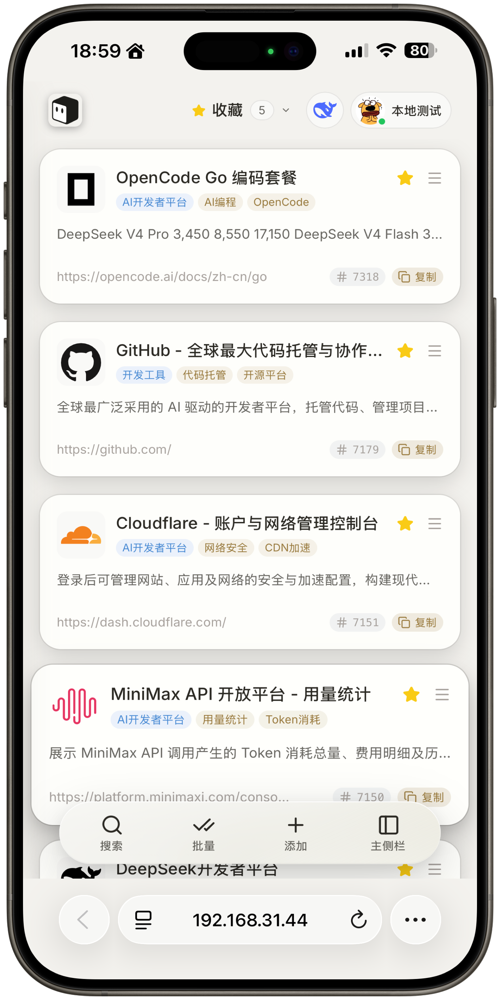
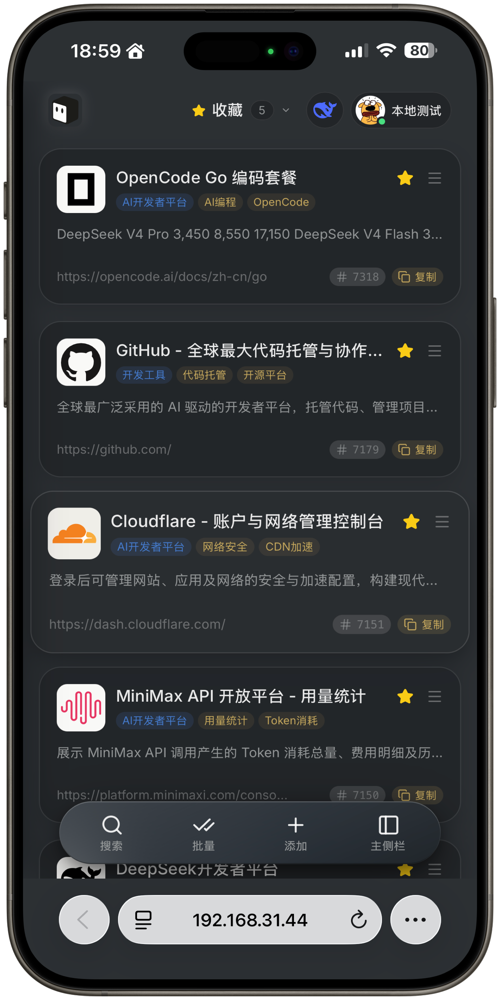

<div align="center">

# Lumen

**自托管的 AI 书签工作台** —— 保存链接，AI 帮你补全；随时用搜索和 API 找回它。

<p>
  
  
  
  
  
  
  
</p>

<p>
  
  
</p>

</div>

## 功能亮点

- 🔗 **粘贴即收藏** — 自动抓取标题、描述与网站图标，识别重复链接
- 🤖 **AI 补全元数据** — 自动生成标题、描述、分类与标签；预置 DeepSeek / 智谱 GLM / MiniMax / 硅基流动，支持自定义 OpenAI / Anthropic 兼容端点，多份配置一键切换
- 🎨 **清晰而轻量的图标** — 品牌 SVG 图标库（theSVG / Simple Icons）优先命中，站点声明与常见路径兜底，6 个图标源并发补齐；统一压至 64 × 64 随书签存储
- 🗂️ **整理而不堆积** — 多级分类、标签、收藏，拖拽排序，批量移动 / 加标签 / 删除
- 🔍 **更快找回** — 标题 / 网址 / ID 搜索，全部 / 收藏 / 未分类视图一键切换
- 🔄 **多端实时同步** — 浏览器标签页与设备之间通过 WebSocket 即时同步
- 🔌 **开放 API** — `msk_` API Token + Bearer 认证，内置 OpenAPI 3.0 说明，接入你的自动化工作流
- 💾 **数据完全属于你** — SQLite 本地存储，JSON 备份 / 导入（自动合并），HTML 只读导出，无第三方遥测
- 🪶 **轻量到极致** — 单一 Go 二进制 + 静态前端，512 MB 内存小机即可运行，空闲内存约 19 MiB
- 📱 **桌面与移动均可用** — 响应式界面，手机与桌面访问均流畅

&emsp;&emsp;&emsp;&emsp;&emsp;&emsp;

## 快速开始

构建需要 Go 1.26、Node.js 24 与 pnpm 11；**运行时只需要一个二进制**，无需 Docker、数据库或其他服务。

```bash
git clone https://github.com/zeno528/lumen.git
cd lumen

# 构建前端并放入 static/ 目录
pnpm -C web install
pnpm -C web build
mkdir -p static
cp -r web/dist/* static/

# 构建后端
go build -o lumen ./server
```

启动前至少设置三个变量。`JWT_SECRET` 同时派生 AES 密钥加密已保存的 AI / Serper 密钥，**首次确定后不要更改**：

```bash
export APP_ENV=production
export JWT_SECRET=$(openssl rand -hex 32)
export APP_PASSWORD='your-strong-password'

./lumen
```

打开服务地址，用 `APP_PASSWORD` 登录（仅在数据库为空时用于初始化，登录后可在设置中心修改）。完整配置项见 [配置](#配置)。

### 常驻运行（systemd）

```ini
# /etc/systemd/system/lumen.service
[Unit]
Description=Lumen
After=network.target

[Service]
WorkingDirectory=/opt/lumen
EnvironmentFile=/opt/lumen/.env
ExecStart=/opt/lumen/lumen
Restart=on-failure

[Install]
WantedBy=multi-user.target
```

```bash
systemctl enable --now lumen
```

## 使用

- **添加书签**：粘贴网址自动抓取信息；点 AI 按钮补全分类和标签
- **整理**：多级分类、标签、收藏；拖拽排序；批量模式（`Ctrl/Cmd + B`）批量移动、加标签、删除、导出
- **找回**：顶栏搜索支持标题、网址与 ID；「全部 / 收藏 / 未分类」视图切换
- **备份**：侧边栏「导出」生成 JSON 备份或 HTML 只读书签页；「导入」自动合并，不会覆盖现有内容
- **多端同步**：多开标签页或在手机打开同一地址，改动实时互相同步

应用内置完整图文帮助：右上角头像菜单 → **帮助**。

## 配置

| 变量 | 默认值 | 说明 |
| --- | --- | --- |
| `APP_ENV` | 空（按生产处理） | `development` / `production`；未显式设为 `development` 即按生产严格校验 |
| `PORT` | `8080` | 监听端口（本地开发用 `8081`） |
| `DB_PATH` | `data/bookmarks.db` | SQLite 数据库文件路径 |
| `STATIC_DIR` | `./static` | 前端静态文件目录 |
| `JWT_SECRET` | 无 | JWT 签名与敏感配置加密密钥；生产必须强随机且确定后不可更改 |
| `APP_PASSWORD` | 无 | 空库首次启动的初始登录密码；生产禁止为空或 `admin` |
| `TRUSTED_PROXY_CIDR` | 空 | 可信反向代理 CIDR（逗号分隔）；空 = 不信任 `X-Forwarded-For` |
| `CORS_ORIGINS` | 空 | 允许的跨域来源（空格分隔）；空 = 仅同源 |
| `GITHUB_CLIENT_ID` / `GITHUB_CLIENT_SECRET` / `GITHUB_ALLOWED_USER` | 空 | 可选的 GitHub OAuth 登录（`GITHUB_ALLOWED_USER` 为用户名白名单） |
| `AI_PROVIDER` / `AI_API_KEY` / `AI_MODEL` / `AI_BASE_URL` | 空 | 环境变量形式的 AI 配置兜底；设置界面保存的配置优先 |
| `SERPER_API_KEY` | 空 | 可选的 Serper 搜索密钥（AI 补全抓取失败时的搜索兜底） |

> 请勿提交 `.env.dev`、数据库、日志或 API 密钥；它们已被 `.gitignore` 排除，提交前仍应检查差异。

## 生产部署

构建产物只有 `lumen` 二进制与 `static/` 目录。推荐用 HTTPS 反向代理（nginx / Caddy）终止 TLS，并确保 WebSocket 升级被正确转发，否则多端实时同步会失效：

```nginx
location / {
    proxy_pass http://127.0.0.1:8080;
    proxy_http_version 1.1;
    proxy_set_header Upgrade $http_upgrade;
    proxy_set_header Connection "upgrade";
    proxy_set_header Host $host;
}
```

若代理与 Lumen 之间存在其他跳转节点，用 `TRUSTED_PROXY_CIDR` 声明可信代理，保证限速与客户端 IP 判断正确。SQLite 驱动为纯 Go 实现，可无 CGO 交叉编译：

```bash
CGO_ENABLED=0 GOOS=linux GOARCH=amd64 go build -ldflags="-s -w" -o lumen ./server
```

仓库内置 GitHub Actions 自动部署：推送到 `main` 会依次执行前端类型检查与构建、Go 检查与测试、后端构建与冒烟测试，再经 SSH + rsync 停服部署并健康检查。启用需在仓库 Secrets 中配置 `DEPLOY_SERVERS`（服务器清单 JSON）与 `VPS_SSH_KEY`（SSH 私钥）。

## 开发

- **后端**：Go 1.26 + chi + modernc.org/sqlite（纯 Go 驱动，可静态编译）+ JWT + WebSocket
- **前端**：React 19 + Vite 8 + TanStack Router / Query + Tailwind CSS v4 + Zustand + shadcn/ui
- **数据流**：TanStack Query 管理服务端状态并持久化缓存（秒开 + 后台刷新）；Zustand 管理客户端状态；WebSocket 推送失效通知驱动多端同步

### 项目结构

```text
server/        Go API、SQLite、鉴权、AI、OpenAPI 与 WebSocket
web/           React 前端与响应式界面（桌面 + 移动）
docs/images/   README 效果图
.github/       CI 与部署工作流
```

### 本地开发

前置条件：Go 1.26、Node.js 24、pnpm 11，以及 [Air](https://github.com/air-verse/air)（Go 热重载）。

```bash
git clone https://github.com/zeno528/lumen.git
cd lumen

# 仅首次安装 Air
go install github.com/air-verse/air@latest

# 创建本地开发配置（.env.dev 已被 .gitignore 忽略）
cp .env.example .env.dev

pnpm -C web install

# 终端 1：Go 后端（Air 热重载，监听 8081）
air -c .air.toml

# 终端 2：前端 Vite（监听 5173，代理 /api 到后端）
pnpm -C web dev:fe
```

打开 [http://localhost:5173](http://localhost:5173)。首次启动时 `.env.dev` 中的 `APP_PASSWORD` 会初始化登录密码，请先替换成自己的开发密码。

### 验证

```bash
pnpm -C web typecheck
pnpm -C web build
go vet ./...
go test ./...
```

## 许可证

Lumen 以 [MIT License](LICENSE) 开源。
